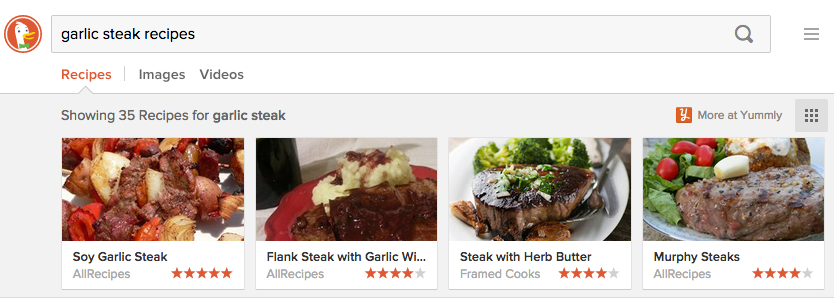
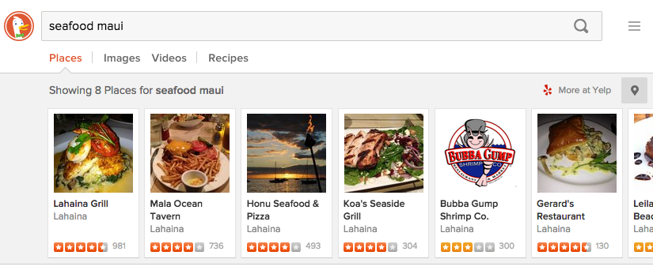
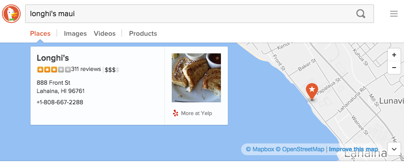
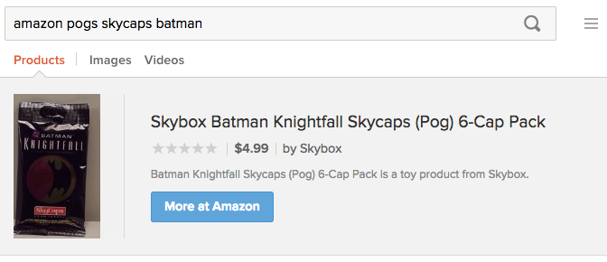
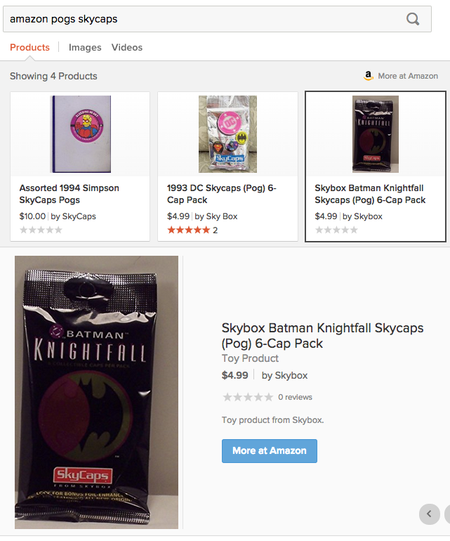

# Templates Overview

When your Instant Answer returns its awesome and delightful result(s), the information is rendered at the top of the DuckDuckGo search results page. The way your results appear and behave is decided by the templates you choose.



## Why Templates Are Great

Templates save a lot of work: they allow contributors to focus on great results. Many Instant Answer frontends can be created entirely by setting various display options and item data, with little or no HTML/CSS coding.

Additionally, Instant Answers that use templates are automatically compatible with future design improvements, with zero extra work.

## Template Groups

Template groups are presets for all template settings; they abstract away all the settings described below. Template groups are the best - and strongly recommended - option for working with templates. 

Read more about [template groups](/duckduckhack/frontend-reference/template-groups.html) and get help [choosing the best one](/duckduckhack/frontend-reference/template-groups.html#picking-a-template-group) for your Instant Answer.

## How Templates Work

Templates are handlebars files which render in the context of **one item** returned by the Instant Answer.

The Instant Answer framework provides you with a wide choice of templates to use, as you will see below as well in the [reference](/duckduckhack/frontend-reference/templates-reference.html).

The built-in templates' options, variables, and [variants](/duckduckhack/frontend-reference/variants-reference.html) are documented in the [Templates Reference](/duckduckhack/frontend-reference/templates-reference.html) section.

### Specifying `item` and `detail` Templates

Instant Answers can return either a **single result** or **multiple results**. To provide the best experience, these two cases can be displayed with different templates.

In your Instant Answer display options (for example, [Spice Display](/duckduckhack/frontend-reference/setting-spice-display.html) or [Goodie Display](/duckduckhack/frontend-reference/setting-goodie-display.html)), you can specify two separate templates:

- `item` template (multiple results)
- `detail` template (single results)

Below is an example of multiple results being returned. Each result is displayed using the template specified for `item`: 



Below is an example of the same Instant Answer returning a single result. This uses the template specified for `detail`:



### Clicking on an Item

In the case of multiple items, clicking on a single item will show the `detail` template below the items. This is the default behavior. To display a template other than the one used for `detail`, specify an `item_detail` template.

This diagram shows what is displayed when an Instant Answer returns multiple items:

```
                                    INSTANT ANSWER RETURNS MULTIPLE ITEMS

+--------------+--------------+--------------+--------------+--------------+--------------+---------------+
|              |              |              |              |              |              |               |
|              |              |              |              |              |              |               |
|              |              |              |              |              |              |               |
|              |              |              |              |              |              |               |
|   `item`     |              |              |              |              |              |               |
|   template   |              |              |              |              |              |               |
|   clicked    |              |              |              |              |              |               |
|              |              |              |              |              |              |               |
|              |              |              |              |              |              |               |
|              |              |              |              |              |              |               |
+--------------+--------------+--------------+--------------+--------------+--------------+---------------+
|                                                                                                         |
|                                                                                                         |
|                                                                                                         |
|                                                                                                         |
|                                              `detail` Template                                          |
|                                                                                                         |
|                                              OR                                                         |
|                                                                                                         |
|                                              `item_detail` (when specified)                             |
|                                                                                                         |
+---------------------------------------------------------------------------------------------------------+
```

For example, the Amazon products search Instant Answer uses one template for single results (`detail`):



However, the Amazon Instant Answer displays a different template when multiple items are returned, and one is clicked (`item_detail`):



#### Disabling Detail Display on Click

To disable the display of a detail template when an item is clicked, set `detail: false`. A side effect of this is that single results will be displayed as tiles.

### When Each Template Is Shown

The Instant Answer framework automatically chooses which template to display based on how many results there are to show and user behavior. Here is the default logic for showing templates:

```
          Instant Answer result      
                   +                     
                   |  
 multiple results  |  single result      
                   |  
         +---------+----------+          
         |                    |          
         |                    |   
         |                    |          
+--------v--------+  +--------v---------+
|                 |  |                  |
|      `item`     |  |      `detail`    |
|                 |  |                  |
+-------+---------+  +------------------+                              
        |                                
        | click an item                   
        |                                
+-------v---------+                      
|                 |                      
|   `detail`      |                      
|       or        |                      
|   `item_detail` |                      
|  (if specified) |
|                 |                     
+-----------------+                      

```

Of course, you can specify template options to modify this; for example, you may want to prevent a particular template from appearing. For example, you might set `detail: false` to make sure your Instant Answer always displays results with the `item` template.

### Template Groups

In practice, you will specify a template group. Template groups are presets which abstract the settings described above.

**Template groups are the best - and strongly recommended - option for working with templates.** Read more about [template groups](/duckduckhack/frontend-reference/template-groups.html) and get help [choosing the best one](/duckduckhack/frontend-reference/template-groups.html#picking-a-template-group) for your Instant Answer.

