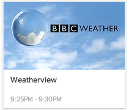
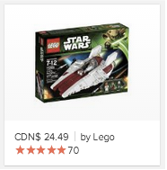
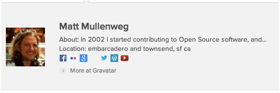
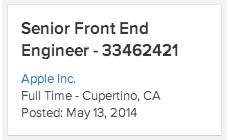
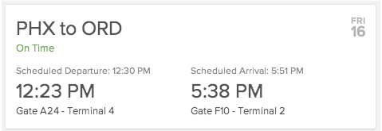

# Templates Reference

Templates are the basic building blocks of Instant Answer displays. Below is a detailed reference of the properties and usage of each.

To understand the context of templates and how they fit into your Instant Answer, start with the [Templates Overview](https://talsraviv.gitbooks.io/duckduckhackdocs/content/duckduckhack/frontend-reference/templates-overview.html).

## Important Note

Before using these templates please familiarize yourself with the Instant Answer display options (for example, [Spice](/duckduckhack/frontend-reference/setting-spice-display.html) or [Goodie](/duckduckhack/frontend-reference/setting-goodie-display.html)) document to understand the proper usage of both the `templates` block and the `options` block. Understanding these is crucial to implementing templates properly and effectively.

You will be specifying these templates indirectly - as part of a Template Group. The [Templates Groups Overview](/duckduckhack/frontend-reference/template-groups.html) will help you think about the big picture of which template groups best fit your Instant Answer.

## Templates

The list of built-in templates includes:

- [`text_item`](#textitem-template)
- [`text_detail`](#textdetail-template)
- [`basic_image_item`](#basicimageitem-template)
- [`products_item`](#productsitem-template)
- [`products_detail`](#productsdetail-template)
- [`products_item_detail`](#productsitemdetail-template)
- [`basic_icon_detail`](#basicicondetail-template)
- [`basic_info_detail`](#basicinfodetail-template)
- [`places_item`](#placesitem-template)
- [`places_detail`](#placesdetail-template)
- [`basic_flipping_item`](#baseflippingitem-template)
- [`base_flipping_item`](#baseflippingitem-template)
- [`list_detail`](#listdetail-template)
- [`record`](#record-template)
- [`media_item`](#mediaitem-template)
- [`media_item_detail`](#mediaitemdetail-template)
- [`images_item`](#imagesitem-template)
- [`images_detail`](#imagesdetail-template)
- [`videos_item`](#videositem-template)
- [`videos_detail`](#videosdetail-template)
- [`base_item`](#baseitem-template)
- [`base_detail`](#basedetail-template)

------

## `text_item` Template

Template for displaying textual information tiles, each with an optional icon.

### Template Diagram


```
+------------------+
icon
title, altSubtitle
subtitle
description
footer
            dateBadge
+------------------+
```

### Available Features

- `icon` [optional] *string url*

	URL path to icon image

- `url` [optional] *string url*
- `title` [required] *string url*
- `altSubtitle` [optional] *string* or *string array*
- `subtitle` [optional] *string* or *string array*
- `description` [required] *string*
- `footer` [optional] [*sub-template*](/duckduckhack/frontend-reference/subtemplates.html)
- `dateBadge` [optional] *object*

	An object with either a `text` *string* property **or** a `month` and `day` *string* properties.
	For an example of this property in action, search for ["concert in toronto"](https://duckduckgo.com/?q=concerts+in+toronto&ia=concerts) and see the [SeatGeek Events by City](https://github.com/duckduckgo/zeroclickinfo-spice/blob/master/share/spice/seat_geek/events_by_city/seat_geek_events_by_city.js) Spice.


### Example Usage

- [GitHub](https://github.com/duckduckgo/zeroclickinfo-spice/blob/master/share/spice/github/github.js)
- [RubyGems](https://github.com/duckduckgo/zeroclickinfo-spice/blob/master/share/spice/ruby_gems/ruby_gems.js)
- [RedditSearch](https://github.com/duckduckgo/zeroclickinfo-spice/blob/master/share/spice/reddit_search/reddit_search.js)
- [AlternativeTo](https://github.com/duckduckgo/zeroclickinfo-spice/blob/master/share/spice/alternative_to/alternative_to.js)

### Template Groups

- [Text](/duckduckhack/frontend-reference/template-groups.html#text-template-group)

------

## `text_detail` Template

A template for displaying textual information detail, with no image or icon.

### Template Diagram


```
+-------------------------------------+

title_content or title
subtitle_content or subtitle
content

+-------------------------------------+
```

### Available Features

- `title_content` [optional] [*sub-template*](/duckduckhack/frontend-reference/subtemplates.html)
- `title` [optional] *string*

	Available only if `title_content` is not specified

- `subtitle_content` [optional] [*sub-template*](/duckduckhack/frontend-reference/subtemplates.html)
- `subtitle` [optional] *string* or *string array*

	Available only if `subtitle_content` is not specified

- `content` [optional] [*sub-template*](/duckduckhack/frontend-reference/subtemplates.html)

### Example Usage

- [Rhymes](https://github.com/duckduckgo/zeroclickinfo-spice/blob/master/share/spice/rhymes/rhymes.js)
- [Thesaurus](https://github.com/duckduckgo/zeroclickinfo-spice/blob/master/share/spice/thesaurus/thesaurus.js)

### Template Groups

- [Text](/duckduckhack/frontend-reference/template-groups.html#text-template-group)

------

## `basic_image_item` Template

A tile template where images are the main feature, accompanied by text.

### Template Diagram



```
+------------------+
image
title
description
rating
ratingText
+------------------+
```

### Available Features

- `url` [optional] *string url*
- `image` [required] *string url*

	URL path to image

- `title` [required] *string*
- `description` [optional] *string*

	Limited to 56 characters, truncated to whole words with an ellipsis

- `rating` [optional] *float*

	A positive float with one decimal point, up to 5.0

- `ratingText` [optional] *string*

### Example Usage

- [Movie](https://github.com/duckduckgo/zeroclickinfo-spice/blob/master/share/spice/movie/movie.js)
- [BBC](https://github.com/duckduckgo/zeroclickinfo-spice/blob/master/share/spice/bbc/bbc.js)

### Template Groups

- [Info](/duckduckhack/frontend-reference/template-groups.html#info-template-group)
- [Media](/duckduckhack/frontend-reference/template-groups.html#media-template-group)

------

## `products_item` Template

A tile item template where images are emphasized, with features suited for items that can be purchased.

### Template Diagram



```
+------------------+
img
title
price
brand
rating
+------------------+
```

### Available Features

- `url` [optional] *string url*
- `img` [required] *string url*
- `title` [required] *string*
- `price` [optional] *string*
- `brand` [optional] *string*
- `rating` [optional] *float*

	A positive float with one decimal point, up to 5.0

- `reviewCount` [optional] *integer*

	The count of reviews
	Automatically formatted to include comma thousands separators

- `url_review` [optional] *string*

	URL path to reviews

### Example Usage

- [Amazon](https://github.com/duckduckgo/zeroclickinfo-spice/blob/master/share/spice/amazon/amazon.js)
- [Octopart](https://github.com/duckduckgo/zeroclickinfo-spice/blob/master/share/spice/octopart/octopart.js)

### Template Groups

- [Products](/duckduckhack/frontend-reference/template-groups.html#products-template-group)

------

## `products_detail` Template

A detail template where image is emphasized, suited to feature for an item that can be purchased.

### Template Diagram


```
+------------------------------------+
                heading
                rating, reviewCount
                price, brand
    img         subtitle_content                
                abstract
                buy
+------------------------------------+
```

### Available Features

- `img` [optional] *string url*

	URL path to image

- `url` [required] *string url*
- `heading`[required] *string*
- `rating` [optional] *float*

	A positive float with one decimal point, up to 5.0

- `reviewCount` [optional] *integer*

	The count of reviews
	Automatically formatted to include comma thousands separators

- `price` [optional] *string*
- `brand` [optional] *string*
- `subtitle_content` [optional] [*sub-template*](/duckduckhack/frontend-reference/subtemplates.html)
- `abstract` [required] *string*

	Limited to 400 characters, truncated to whole words with an ellipsis

- `buy` [optional] [*sub-template*](/duckduckhack/frontend-reference/subtemplates.html)

	Can be used to provide a call-to-action, such as a button.

### Example Usage

- [Amazon](https://github.com/duckduckgo/zeroclickinfo-spice/blob/master/share/spice/amazon/amazon.js)
- [Octopart](https://github.com/duckduckgo/zeroclickinfo-spice/blob/master/share/spice/octopart/octopart.js)

### Template Groups

- [Products](/duckduckhack/frontend-reference/template-groups.html#products-template-group)
- [Media](/duckduckhack/frontend-reference/template-groups.html#media-template-group)
- [Icon](/duckduckhack/frontend-reference/template-groups.html#icon-template-group)

------

## `products_item_detail` Template

A template for drilling-down into a particular item on the same page. Emphasizes an image, and suited to feature for an item that can be purchased. This template features an optional call-to-action.

### Template Diagram


```
+------------------------------------+
                heading
                price, brand
    img_m       subtitle_content
                rating, reviewCount
                abstract
                buy
+------------------------------------+
```

### Available Features

- `img_m` [optional] *string url*

	URL path to image

- `heading` [required] *string*
- `url` [required] *string url*
- `price` [optional] *string*
- `brand` [optional] *string*
- `subtitle_content` [optional] [*sub-template*](/duckduckhack/frontend-reference/subtemplates.html)
- `rating` [optional] *float*

	A positive float with one decimal point, up to 5.0

- `reviewCount` [optional] *integer*

	The count of reviews
	Automatically formatted to include comma thousands separators

- `url_review` [optional] *string url* 
	
	Link to source reviews page
	
- `abstract` [required] *string*
- `buy` [optional] [*sub-template*](/duckduckhack/frontend-reference/subtemplates.html)

	Can be used to provide a call-to-action, such as a button.

### Example Usage

- [BBC](https://github.com/duckduckgo/zeroclickinfo-spice/blob/master/share/spice/bbc/bbc.js)
- [Movie](https://github.com/duckduckgo/zeroclickinfo-spice/blob/master/share/spice/movie/movie.js)

### Template Groups

- [Products](/duckduckhack/frontend-reference/template-groups.html#products-template-group)
- [Media](/duckduckhack/frontend-reference/template-groups.html#media-template-group)
- [Icon](/duckduckhack/frontend-reference/template-groups.html#icon-template-group)

------

## `basic_icon_detail` Template

A template for displaying textual information detail, with a small image, icon, or character badge.

### Template Diagram

```
+------------------------------------------------+
image and/or badge      title
                        subtitle
                        altSubtitle

                        content *or* description                        

+------------------------------------------------+
```

### Available Features

- `image` [optional] *string url*

	URL path to image
	
- `badge` [optional] *string*
- `title` [optional] *string*
- `subtitle` [optional] *string* or *string array*
- `altSubtitle` [optional] *string* or *string array*
- `content` [optional] [*sub-template*](/duckduckhack/frontend-reference/subtemplates.html)
- `description` [conditional on `content`] *string*

	Available and required if `content` not specified

### Example Usage

*None - yet*

### Template Groups

- [Icon](#icon-template-group)

------

## `basic_info_detail` Template

A detail template which shows in-depth information. This template includes an auxiliary area for listing properties.

### Template Diagram



The same template, with the `aux` feature:


```
+-------------------------------------------------------+
                title
    image       subtitle                        
                content or description          infoboxData
+-------------------------------------------------------+
```

### Available Features

- `url` [required] *string url*
- `image` [optional] *string url*

	URL path to image

- `title` [optional] *string*
- `subtitle` [optional] *string* or *string array*

	Available only if `title` specified

- `content` [optional] [*sub-template*](/duckduckhack/frontend-reference/subtemplates.html)
- `description` [conditional on `content`] *string*

	Available and required if `content` not specified

- `infoboxData` [optional] *array*	

	An array of objects used to render an [InfoBox](#the-infobox)

### Example Usage

- [Bitcoin](https://github.com/duckduckgo/zeroclickinfo-spice/blob/master/share/spice/bitcoin/bitcoin.js)
- [Gravatar](https://github.com/duckduckgo/zeroclickinfo-spice/blob/master/share/spice/gravatar/gravatar.js)
- [Drinks](https://github.com/duckduckgo/zeroclickinfo-spice/blob/master/share/spice/drinks/drinks.js)

### Template Groups

- [Info](/duckduckhack/frontend-reference/template-groups.html#info-template-group)

### The Infobox

In the `basic_info_detail` template, the **InfoBox** floats on the right side of the AnswerBar. It presents detailed information in a table of key-value pairs:


To display the InfoBox in the `basic_info_detail` template, an item must have an `infoboxData` property specified. This is an array of objects, each with the following properties:

- `label` [required] *string*
- `url` [optional] *string url*

	Used to turn `label` element into a link

- `value` [optional] *string or array*

	Use array to display [nested properties](#infobox-nested-properties))

The first object in the array can also be used solely to specify a heading for the InfoBox. This object would contain only one property:

- `heading` [optional] *string*

	Specified in its own separate object, first in the array

For example, when ["mtg nullify"](https://duckduckgo.com/?q=mtg+nullify&ia=magicthegathering) is searched, [mtg.js](https://github.com/duckduckgo/zeroclickinfo-spice/blob/master/share/spice/mtg/mtg.js) dynamically generates the following array for `infoboxData`:

```javascript
[
    {
        heading: "Card Details"
    },
    {
        label: "Mana Cost",
        value: "UU"
    },
    {
        label: "Converted Mana Cost",
        value: 2
    },
    ...
]
```

This data shows up in the AnswerBar, to the right:


It is also possible to specify labels alone, with or without urls. This is the `infoboxData` value generated by [urban_dictionary.js](https://github.com/duckduckgo/zeroclickinfo-spice/blob/master/share/spice/urban_dictionary/urban_dictionary.js) when searching for ["urban dictionary cool"](https://duckduckgo.com/?q=urban+dictionary+cool&ia=dictionary):

```javascript
[
    {
        heading: "Related Terms:"
    },
    {
        label: "Awesome",
        url: "https://duckduckgo.com/?q=ud+awesome&ia=dictionary"
    },
    {
        label: "Amazing",
        url: "https://duckduckgo.com/?q=ud+amazing&ia=dictionary"
    },
    ...
]
```

This appears as:


#### InfoBox Nested Properties

The `value` property of `infoboxData` objects can *also* be passed an array of objects. These objects have the following properties:

- `label` [required] *string*
- `value` [required] *string*

For example, the resulting array passed to `infoboxData` could be structured this way:

```javascript
[
    {
        heading: "About Me"
    },
    {
        label: "My Favorites",
        value: [
            {
                label: "Color",
                value: "Red"
            },
            {
                label: "Animal",
                value: "Duck"
            },
            ...
        ]
    },
    ...
]
```

------

## `places_item` Template

An item template which displays multiple location results on one map.

Clicking a places item both indicates its location on a map, as well as 'flips' the item to display more detailed information. The `places_item` template can conceptually be divided into its 'front' and 'back'.

### Template Diagram

#### 'Front'


```
+--------------------+


        image


+--------------------+
name
ratingImageURL *or* rating
reviews
+--------------------+
```

#### 'Back'

This view is displayed when the 'front' is clicked, together with the map (below).


```
+--------------------+

name (url)

price

address_lines *or* address

phone

+--------------------+
```

### Available Features

#### 'Front' of each item:
- `image` [optional] *string url*

	Path to image

- `name` [required] *string*
- `title` [optional] *string*

	Available only if `image` specified

- `ratingImageURL` [optional] *string url*
- `rating` [optional] *float*

	A positive float with one decimal point, up to 5.0
	Available only if `ratingImageURL` is not specified

- `reviews` [optional] *integer*

	The count of reviews
	Automatically formatted to include comma thousands separators

#### 'Back' of each item: (displayed upon click)
- `name` [required] *string*
- `url` [required] *string url*
- `price` [optional] *integer*

	Integer between 1 and 4; converted to a dollar-sign rating (such as '$' or '$$$$')

- `address_lines` [optional] *array*

	An array of strings, one for each line

- `address` [optional] *string*

	Available only if `address_lines` not specified
	Limited to 65 characters, truncated to whole words with an ellipsis

- `phone` [optional] *string*

#### Map View

This view is displayed when the 'front' is clicked, together with the 'back' (above).


### Example Usage

- Local results (built-in to DDG): search for [cafes near Ann Arbor](https://duckduckgo.com/?q=cafes+near+ann+arbor).

### Template Groups

- [Places](/duckduckhack/frontend-reference/template-groups.html#places-template-group)

------

## `basic_flipping_item` Template

This template is used to replace `places_item` on the front and back of the item tile. This template maintains the unique 'flip' behavior of `places_item`.

### Template Diagram

#### 'Front'

These properties are passed to the template inside a `data_front` object (e.g. `data_front.title`).

```
+--------------------+


    icon
    title, altsubtitle
    subtitle
    footer_content


+--------------------+
```

#### 'Back'

This view is displayed when the 'front' is clicked, together with the map (below). These properties are passed to the template inside a `data_back` object (e.g. `data_back.title`).

```
+--------------------+


    icon
    title, altsubtitle
    subtitle
    footer_content


+--------------------+
```

### Available Features

#### 'Front' of each item:

These properties are passed to the template inside a `data_front` object (e.g. `data_front.title`).

- `icon` [optional]
- `title` [optional]
- `altsubtitle` [optional]
- `subtitle` [optional]
- `footer_content` [optional] [*sub-template*](/duckduckhack/frontend-reference/subtemplates.html)

#### 'Back' of each item: (displayed upon click)

These properties are passed to the template inside a `data_back` object (e.g. `data_back.title`).

- `icon` [optional]
- `title` [optional]
- `altsubtitle` [optional]
- `subtitle` [optional]
- `footer_content` [optional] [*sub-template*](/duckduckhack/frontend-reference/subtemplates.html)

#### Map View

As with `places_item`, map view is displayed when the 'front' is clicked, as it displays the 'back'.

### Example Usage

- [GetEvents](https://github.com/duckduckgo/zeroclickinfo-spice/blob/master/share/spice/get_events/get_events.js): search for [events in new york](https://duckduckgo.com/?q=events+in+new+york&ia=list)

	In [`get_events.js`](https://github.com/duckduckgo/zeroclickinfo-spice/blob/master/share/spice/get_events/get_events.js), the `places` template group is specified, and overrides the `item` template. 

    ```javascript
    templates: {
        group: 'places',
        item: 'basic_flipping_item'
    }
    ```

	The `normalize` function returns the data for each side, contained within the `data_front` and `data_back` properties:
	
	```javascript
	return {
		data_front: {
		    showPin: true,
		    title: item.name,
		    venue: item.venue,
		    image: item.image_large_url,
		    altSubtitle: formatSubtitleString(item),

		    footer_content: Spice.get_events.foot_front,

		    footLines: '4',
		    titleClass: 'tile__title--3 tx--16 tx--bold mg--none',
		    altSubClass: 'tx--13 tx-clr--grey'
		},
		data_back: {
		    title: item.name,
		    url: buildUrl(item.id),
		    description: item.description ? DDG.strip_html(item.description) : 'No description available.',

		    footer_content: Spice.get_events.foot_back,

		    titleClass: 'tile__title--1 tx--16 tx--bold'
		},
		city: item.venue.city,
		place: item.venue.name,
		lat: item.venue.lat,
		lon: item.venue.lng
	};
	```

### Template Groups

- Used with [Places](/duckduckhack/frontend-reference/template-groups.html#places-template-group)

------

## `base_flipping_item` Template

This template is used to replace `places_item` with custom sub-templates for the front and back of the item tile. This template maintains the unique 'flip' behavior of `places_item`, while allowing full customization of both sides.

**Use as a last resort** due to the large amount of upfront work and ongoing maintenance involved. Please contact us at [open@duckduckgo.com](mailto:open@duckduckgo.com) *before* using this template.

### Template Diagram

#### 'Front'

```
+--------------------+


    front_content


+--------------------+
```

#### 'Back'

This view is displayed when the 'front' is clicked, together with the map (below).

```
+--------------------+


    back_content


+--------------------+
```

### Available Features

#### 'Front' of each item:

- `front_content` [required] [*sub-template*](/duckduckhack/frontend-reference/subtemplates.html)

#### 'Back' of each item: (displayed upon click)

- `back_content` [required] [*sub-template*](/duckduckhack/frontend-reference/subtemplates.html)

#### Map View

As with `places_item`, map view is displayed when the 'front' is clicked, as it displays the 'back'.

### Example Usage

- [Parking Panda](https://github.com/duckduckgo/zeroclickinfo-spice/blob/master/share/spice/parking/parking.js): search for [parking in new york](https://duckduckgo.com/?q=parking+in+new+york).
	
	In `parking.js`, the `places` template group is specified, and override the `item` template. Then the two [custom sub-templates](/duckduckhack/frontend-reference/subtemplates.html) are specified under `options`.

    ```javascript
    templates: {
        group: 'places',
        item: 'base_flipping_item',
        options: {
            front_content: Spice.parking.item_front,
            back_content: Spice.parking.item_back
        }
    }
    ```

### Template Groups

- Used with [Places](/duckduckhack/frontend-reference/template-groups.html#places-template-group)

------

## `places_detail` Template

A detail template for displaying information about a single location on a map backdrop.

### Template Diagram


```
+--------------------------------+------------+
|   name (url)                   |            |
|                                | image (url)|
|   ratingImageURL *or* rating   |            |
|   reviews                      |            |
|   price                        |            |
|   address_lines *or* address   |            |
|   phone                        |            |
|                                |            |
|                                |            |
+--------------------------------+            |
|                                |            |
|    hours                       |            |
|                                |            |
+--------------------------------+------------+
```

### Available Features

- `url` [required] *string url*
- `name` [required] *string*
- `image` [optional] *string url*

	URL path to image

- `title` [optional]

	Used at `alt` attribute of the `image` element

- `hours` [optional] *array*

	Array of objects, each containing `day` and `hours` properties

- `ratingImageURL` [optional]
- `rating` [optional] *float*

	A positive float with one decimal point, up to 5.0
	Available only if `ratingImageURL` not specified

- `reviews` [optional] *integer*

	The count of reviews
	Automatically formatted to include comma thousands separators

- `price` [optional] *integer*

	Integer between 1 and 4; converted to a dollar-sign rating (such as '$' or '$$$$')- `address_lines` [optional] *array*

	An array of strings, one for each line

- `address` [optional] *string*

	Available only if `address_lines` not specified

- `phone` [optional] *string*

### Example Usage

- Local results (built-in to DDG): search for [a particular business](https://duckduckgo.com/?q=espresso+italiano+maui).

### Template Groups

- [Places](/duckduckhack/frontend-reference/template-groups.html#places-template-group)

------

## `list_detail` Template

A detail template for displaying of a title and subtitle above a bulleted list, or a table of key-value pairs.

### Template Diagram


```
+-------------------+

title
subtitle

content, record_data
*or*
list_content, list

+-------------------+
```

### Available Features

- `title` [optional] *string*
- `subtitle` [optional] *string* or *string array*

#### If Displaying Table of Key-Value Pairs:

- `content` [required] [*sub-template*](/duckduckhack/frontend-reference/subtemplates.html)

	Recommended to set this value to `'record'` (a string) to specify the built-in [`record`](#record-template) sub-template. Learn more about [built-in sub-templates](/duckduckhack/frontend-reference/subtemplates.html).

- `record_data` [required] *object*

	Includes the key-value pairs to display

#### If Displaying Bulleted List of Values:

- `list_content` [required] [*sub-template*](/duckduckhack/frontend-reference/subtemplates.html)

	Supply a custom handlebars sub-template. The sub-template will be rendered, enclosed by a `li` element. Learn more about [sub-templates](/duckduckhack/frontend-reference/subtemplates.html).

- `list` *array*

	Array of objects, each contains the properties used by `list_content` sub-template

### Usage

To display a bulleted list, pass a sub-template to the `list_content` property. To display a table of key-value pairs, pass the [`record`](#record-template) template to the `content` property.

When displaying a bulleted list, the simplest case would be to pass `list` an array of objects like `{value: 'foo'}` and specify `list_content` to be a sub-template which only reads `{{value}}`.

### Example Usage

- [Whois](https://github.com/duckduckgo/zeroclickinfo-spice/blob/master/share/spice/whois/whois.js) (search for ['whois mozilla.org'](https://duckduckgo.com/?q=whois+mozilla.org))

### Template Groups

- [List](/duckduckhack/frontend-reference/template-groups.html#list-template-group)

------

## `record` Template

A special template that is ideal for key-value data. It generates a `<table>` where each row contains a key and value. Often used as a sub-template, for example by the [`list_detail`](#list_detail-template) template.

### Template Diagram


```
+---------------------------------------------+
*key*           *value*
*key*           *value*     (of record_data)
*key*           *value*
...
+---------------------------------------------+
```

### Available Features

- `record_data` [required] *object*

	Contains key-value pairs to display in table format
	Values limited to 350 characters, truncated to whole words with an ellipsis

### Usage

This template requires that a `record_data` property, which should contain the key-value data to be displayed. All the properties of the `record_data` object will be used as the keys for the table.

However, if you want to specify exactly which properties of the `record_data` object should be displayed, you can define an optional `record_keys` property. This is an array of strings, specifying which key-value pairs of `record_data` will be included.

An optional property called `rowHighlight` can be added to `options` to turn on alternating row highlighting.

### Sample Code

```javascript
data: {
    record_data: {
        name: 'Bob',
        phone: '123-456-7890',
        email: 'bob@bobstheman.com',
        address: '123 First Street'
    }
},
normalize: function(item){
    return {
        record_keys: ["name", "phone", "email"]
    }
},
templates: {
    group: 'base',
    options: {
        content: 'record',
        /* optional - highlight alternate rows */
        rowHighlight: true
    }
}
```

### Example Usage

- [UrbanDictionary](https://github.com/duckduckgo/zeroclickinfo-spice/blob/master/share/spice/urban_dictionary/urban_dictionary.js)
- [MetaCpan](https://github.com/duckduckgo/zeroclickinfo-spice/blob/master/share/spice/meta_cpan/meta_cpan.js)
- [CodeSearch](https://github.com/duckduckgo/zeroclickinfo-spice/blob/master/share/spice/code_search/code_search.js)
- [Whois](https://github.com/duckduckgo/zeroclickinfo-spice/blob/master/share/spice/whois/whois.js)

### Template Groups

- Can be used as a sub-template by the [List](/duckduckhack/frontend-reference/template-groups.html#list-template-group) template group (under the [`list_detail`](#listdetail-template) template)

------

## `media_item` Template

### Template Diagram

```
+----------------------+

        image


title
altSubtitle
subtitle
description
footer
dateBadge   

+----------------------+
```

### Available Features

- `title` [required] *string*
- `altSubtitle` [optional] *string* or *string array*
- `subtitle` [optional] *string* or *string array*
- `description` [optional] *string*
- `footer` [optional] [*sub-template*](/duckduckhack/frontend-reference/subtemplates.html)
- `dateBadge` [optional] *object*

	An object with either a `text` *string* property **or** a `month` *string* and `day` *string* properties. 
	For an example of a `dateBadge` in action, search for ["concert in toronto"](https://duckduckgo.com/?q=concerts+in+toronto&ia=concerts) and see the [SeatGeek Events by City](https://github.com/duckduckgo/zeroclickinfo-spice/blob/master/share/spice/seat_geek/events_by_city/seat_geek_events_by_city.js) Spice. (The example uses the `text_item` template, but the dateBadge is the same.)

### Example Usage

- [Dogo News](https://github.com/duckduckgo/zeroclickinfo-spice/blob/master/share/spice/dogo_news/dogo_news.js)

### Template Groups

- [Media](/duckduckhack/frontend-reference/template-groups.html#media-template-group)

------

## `media_item_detail` Template

### Template Diagram

```
+------------------------------------------------------------------+
						title, altSubtitle
	image				subtitle
						description
						callout
+------------------------------------------------------------------+
```

### Available Features

- `image` [optional] *string url*
- `title` [required] *string*
- `altSubtitle` [optional] *string* or *string array*
- `description` [optional] *string*
- `callout` [optional] [*sub-template*](/duckduckhack/frontend-reference/subtemplates.html)

	Can be used to provide a call-to-action, such as a button.

### Example Usage

- [Dogo News](https://github.com/duckduckgo/zeroclickinfo-spice/blob/master/share/spice/dogo_news/dogo_news.js)

### Template Groups

- [Media](/duckduckhack/frontend-reference/template-groups.html#media-template-group)

------

## `images_item` Template

### Template Diagram

#### Regular State

```
+-------------------+

    thumbnail

+-------------------+
```

#### Hover State

```
+-------------------+

   width × height

+-------------------+
```


### Available Features

- `thumbnail` [required] *string url*
- `tileWidth` [required] *integer*

	The pixel width of the **thumbnail** image - may vary among tiles
	
- `title` [optional] *string*

	The `alt` html attribute of the image element
	
- `width` [required] *integer*

	The pixel width of the **original** image.

- `height` [required] *integer*

	The pixel height of the **original** image.

### Example Usage

- Search for ["duck images"](https://duckduckgo.com/?q=duck+images&ia=images) (built-in images Instant Answer)

### Template Groups

- [Images](/duckduckhack/frontend-reference/template-groups.html#images-template-group)

------

## `images_detail` Template

### Template Diagram

```
+------------------------------------------------------------------+


    thumbnail                   title
    or                          url
    highResImage                width × height
                                image

+------------------------------------------------------------------+
```

### Available Features

- `thumbnail` [required] *string url*
- `highResImage` [optional] *string url*
- `title` [required] *string*
- `url` [required] *string url*
	
	Path to image source page (the page on which the image was originally embedded)
	
- `width` [required] *integer*

	The pixel width of the **original** image.

- `height` [required] *integer*

	The pixel height of the **original** image.

- `image` [required] *string url*

	Path to image source file (the original image file path)

### Example Usage

- Search for ["duck images"](https://duckduckgo.com/?q=duck+images&ia=images) and click on any item (built-in images Instant Answer)

### Template Groups

- [Images](/duckduckhack/frontend-reference/template-groups.html#images-template-group)

------

## `videos_item` Template

### Template Diagram

```
+----------------------+

    images.medium

    duration


    title
    viewCount

+----------------------+
```

### Available Features

- `images` [required] *object*

	Object with paths to various image sizes. This template requires a `medium` property.
	
- `duration` [required] *string url*

	Duration of the video, in HH:MM:SS format (e.g. '5:32' or '2:01:59')
	
- `title` [required] *string* 
- `viewCount` [required] *string* 

	Number of video views, preferably with commas as the thousands separator (value not formatted automatically)

### Example Usage

- Search for ["gopro videos"](https://duckduckgo.com/?q=gopro+videos&ia=videos&iai=vutn7IUCKck) (built-in videos search)

### Template Groups

- [Videos](/duckduckhack/frontend-reference/template-groups.html#videos-template-group)

------

## `videos_detail` Template

### Template Diagram

```
+------------------------------------------------------------------+


    [video content]             title
                                username
                                viewCount
                                published

+------------------------------------------------------------------+
```

### Available Features

- `title` [required] *string*
- `url` [required] *string url*
- `username` [required] *string*
- `viewCount` [required] *string*
- `published` [required] *string*

	A date string in any format recognized by the JavaScript [`Date.parse()`](https://developer.mozilla.org/en-US/docs/Web/JavaScript/Reference/Global_Objects/Date/parse) method

### Example Usage

- ["gopro videos"](https://duckduckgo.com/?q=gopro+videos&ia=videos&iai=vutn7IUCKck) and click on any item (built-in videos Instant Answer)

### Template Groups

- [Videos](/duckduckhack/frontend-reference/template-groups.html#videos-template-group)

------

## `base_item` Template

An item template for containing fully customized markup.

**Use as a last resort** due to the large amount of upfront work and ongoing maintenance involved. Please contact us at [open@duckduckgo.com](mailto:open@duckduckgo.com) *before* using this template.

### Template Diagram



```
+---------------------------------+


        content (template)


+---------------------------------+
```

### Available Features

- `url` [required] *string*
- `content` [required] [*sub-template*](/duckduckhack/frontend-reference/subtemplates.html)

### Example Usage

- [GithubJobs](https://github.com/duckduckgo/zeroclickinfo-spice/blob/master/share/spice/github_jobs/github_jobs.js)
- [Airlines](https://github.com/duckduckgo/zeroclickinfo-spice/blob/master/share/spice/airlines/airlines.js)

### Complex Example

Here is an example of a more complex `content` sub-template passed to the `base_item` template.



### Template Groups

- [Base](/duckduckhack/frontend-reference/template-groups.html#base-template-group)

------

## `base_detail` Template

A detail template for containing fully customized markup.

**Use as a last resort** due to the large amount of upfront work and ongoing maintenance involved. Please contact us at [open@duckduckgo.com](mailto:open@duckduckgo.com) *before* using this template.

### Template Diagram


```
+---------------------------------+


        content (template)


+---------------------------------+
```

### Available Features

- `content` *string* or [*sub-template*](/duckduckhack/frontend-reference/subtemplates.html)

### Example Usage

- [FlashVersion](https://github.com/duckduckgo/zeroclickinfo-spice/blob/master/share/spice/flash_version/flash_version.js)
- [NPM](https://github.com/duckduckgo/zeroclickinfo-spice/blob/master/share/spice/npm/npm.js)
- [XKCD](https://github.com/duckduckgo/zeroclickinfo-spice/blob/master/share/spice/xkcd/xkcd.js)

### Complex Example


### Template Groups

- [Base](/duckduckhack/frontend-reference/template-groups.html#base-template-group)

